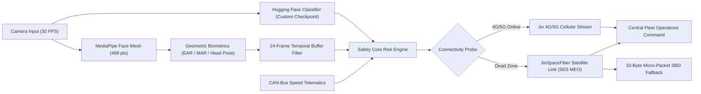

# DRISHTI AI 🚗🛰️
### Autonomous Edge-AI Driver Safety System & Multi-Tier JioSpaceFiber Satellite Telematics

[](tests/)
[](ai_tracking/)
[-00d4ff.svg)](fleet_gatekeeper_hub.py)
[](#)

**DRISHTI AI** is a commercial-grade, edge-AI driver monitoring and vehicular safety platform designed for high-risk fleet transit in rugged mountain corridors (e.g., Darjeeling's Hill Cart Road, Zoji La, Sikkim, and mining passes).

By fusing **MediaPipe Face Mesh biometrics**, a fine-tuned **Hugging Face Driver Classifier**, temporal noise-filtering, and an intelligent **JioSpaceFiber (SES MEO)** satellite failover architecture, DRISHTI AI provides continuous driver protection and life-safety dispatch even when traveling through zero-connectivity Himalayan dead zones.

---

## ⚡ Quick Start (1-Click Launchers)

For team members and live presentations on Windows:

| Launcher Script | What It Does | Target URL / Output |
| :--- | :--- | :--- |
| **`run_demo.bat`** *(Double-click)* | Launches both Central Dashboards concurrently | [Flask :5000](http://localhost:5000/) & [Gradio :7860](http://localhost:7860/) |
| **`run_hybrid_satellite_demo.bat`** | Runs live JioSpaceFiber dead-zone satellite failover | Interactive Terminal Console |
| **`run_tests.bat`** | Executes the full 19-test automated test suite | `Ran 19 tests — OK` |

---

## 🎯 The Three Live Pitch Demonstrations

Complete presentation instructions and talking points are available in the **[Executive Demo Pitch Guide](DEMO_PITCH_GUIDE.md)**.

### 👁️ Demo 1: The Live "Hairpin Bend" & Blind-Spot Simulation
* **Platform**: [http://localhost:5000/](http://localhost:5000/)
* **The Pitch**: Conventional dashcams sound annoying false alarms on every sharp turn. DRISHTI AI utilizes a **24-frame temporal buffer** that absorbs brief lateral head movements (checking mirrors on sharp mountain hairpins). 
* **The Climax**: The exact millisecond the driver's eyes remain closed for **$> 1.5\text{ seconds}$**, the dashboard flashes an intense red border, rings an audio alarm, and flags `CRITICAL: DROWSINESS DETECTED`.

### 📡 Demo 2: The "Deep Valley" Satellite Failover (JioSpaceFiber)
* **Command**: `run_hybrid_satellite_demo.bat`
* **The Pitch**: In steep Himalayan gorges where competitor platforms lose signal and go blind, DRISHTI AI automatically detects cellular loss within 0.8s and shifts routing to **JioSpaceFiber** (leveraging India's licensed SES O3b mPOWER satellite constellation):
  ```text
  ⚠️ [NETWORK CRITICAL] 4G/5G connection lost. Routing shifted to JioSpaceFiber Satellite Link.
  🛰️ [SATELLITE_TX] 4G/5G Signal Dead. Pushing compressed hex packet via JioSpaceFiber link: DRST|V1|R:HIG|F:dist
  ```
* **Store-and-Forward**: Low-priority telemetry is cached in an offline SQLite queue; the moment cellular connectivity is restored, it drains and syncs automatically with zero data loss.

### 🏎️ Demo 3: Keyboard-Driven CAN-Bus Telematics & Speed Intercepts
* **Platform**: [http://localhost:5000/](http://localhost:5000/) or `python demo_can_telematics.py`
* **Controls**: Press **Up / Down Arrow keys** (or click on-screen buttons) to modulate vehicle speed.
* **The Escalation**:
  - At cruising speed ($60\text{ km/h}$), looking away is flagged as **`MODERATE RISK`** (amber badge, standard 4G/5G link).
  - Accelerating past **$80\text{ km/h}$** (overspeed threshold) while distracted immediately escalates risk to **`🚨 HIGH RISK`**, triggering prioritized satellite dispatch over JioSpaceFiber.

---

## 🏗️ Architecture Blueprint



---

## 📂 Core Project Components

* **`app.py`**: Central Operations Command web dashboard (zero-latency MJPEG video streaming, live speedometer, interactive CAN controls, dynamic satellite badge).
* **`gradio_app.py`**: Gradio telemetry inspector with signal breakdown and remote intervention triggers.
* **`fleet_gatekeeper_hub.py`**: Headless enterprise gatekeeper with hybrid cellular/JioSpaceFiber routing, store-and-forward SQLite caching, and Windows UTF-8 emoji support.
* **`ai_tracking/driver_monitor.py`**: Real-time facial biometrics, EAR/MAR calculation, head pose estimation, and temporal filter overlays.
* **`ai_tracking/safety_core.py`**: Multi-signal risk assessment matrix and speed escalation logic ($80\text{ km/h}$ threshold).
* **`ai_tracking/huggingface_client.py`**: Non-blocking asynchronous Hugging Face inference pipeline.
* **`demo_can_telematics.py`**: Standalone terminal CAN-bus speed controller for companion-screen presentations.

---

## 👥 Documentation for Collaborators

* 📘 **[Team Onboarding & Architecture Master Guide](TEAM_ONBOARDING_AND_ARCHITECTURE.md)**: Full architecture breakdown, developer setup, code layout, and extension points.
* 🎤 **[Executive Demo Pitch Guide](DEMO_PITCH_GUIDE.md)**: Presentation script and talking points for stakeholders and investors.

---

## 🧪 Testing & Verification

Run the comprehensive test suite:
```powershell
& ".\.venv\Scripts\python.exe" -m unittest discover tests
```
*19 unit tests passing covering risk calculation, speed escalation, Hugging Face classification, and satellite hex serialization.*
