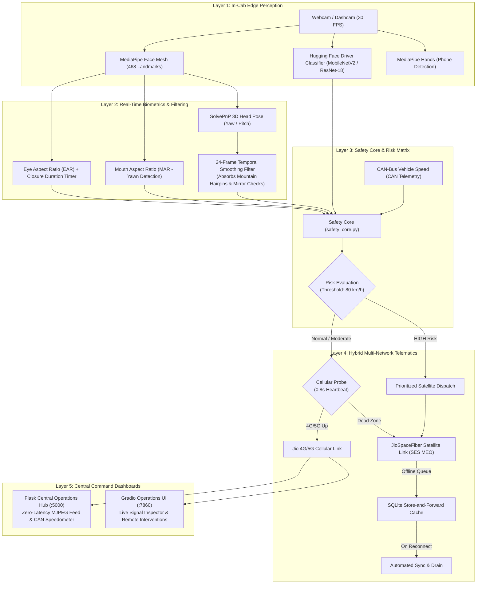

# DRISHTI AI — Team Onboarding & Architecture Master Guide
*Commercial-Grade Edge AI Driver Safety & JioSpaceFiber Satellite Telematics*

Welcome to the **DRISHTI AI** development team! This handbook contains everything you need to understand the architecture, run the system, present live pitches, and contribute to future engineering milestones.

---

## 🧭 1. System Architecture Overview

DRISHTI AI is designed specifically for high-risk fleet operations in treacherous terrains (e.g., Darjeeling's Hill Cart Road, Zoji La, Ladakh border corridors) where conventional dashcams fail due to frequent false alarms and cellular dead zones.



---

## 📂 2. Repository File Structure

```text
DHRISTI AI 1.1/
├── app.py                          # Flask Central Operations Hub (Port 5000)
├── gradio_app.py                   # Gradio AI Telemetry Dashboard (Port 7860)
├── launch_all.py                   # Concurrent launcher with auto-polling & browser open
├── fleet_gatekeeper_hub.py         # Gatekeeper hub with JioSpaceFiber hybrid failover
├── demo_can_telematics.py          # Standalone CAN-bus terminal speed controller
│
├── ai_tracking/
│   ├── driver_monitor.py           # Core DMS: MediaPipe Face Mesh, temporal filters, overlays
│   ├── safety_core.py              # Pure-logic safety policy, risk escalation, threshold logic
│   ├── huggingface_client.py       # Asynchronous zero-lag Hugging Face model client
│   └── driver_monitor_dashboard.py # Camera selection and validation utilities
│
├── data/
│   └── generate_synthetic_dataset.py # Synthetic driver dataset generator
│
├── models/
│   └── drishti_driver_classifier/  # Trained Hugging Face model checkpoints
│
├── tests/
│   ├── test_safety_core.py         # Unit tests for policy, risk levels, and speed escalation
│   └── test_huggingface.py         # Unit tests for Hugging Face integration and fallbacks
│
├── run_demo.bat                    # 1-Click double-clickable launcher for both dashboards
├── run_hybrid_satellite_demo.bat   # 1-Click launcher for JioSpaceFiber dead-zone failover
├── run_tests.bat                   # 1-Click runner for test suite (19 tests)
├── launch_both_dashboards.ps1      # PowerShell launcher for dashboards
├── DEMO_PITCH_GUIDE.md             # Complete executive presentation runbook
└── TEAM_ONBOARDING_AND_ARCHITECTURE.md # This guide
```

---

## 🚀 3. Quick Setup for New Team Members

### Step 1: Clone Repository
```bash
git clone git@github.com:abvesar/dristhiai.git
cd dristhiai
```

### Step 2: Create & Activate Virtual Environment
```powershell
python -m venv .venv
.\.venv\Scripts\Activate.ps1
```

### Step 3: Install Dependencies
```powershell
pip install -r requirements.txt
# Core dependencies: opencv-python, mediapipe, flask, gradio, torch, transformers
```

### Step 4: Run Health Verification Tests
```powershell
.\run_tests.bat
# Or:
& ".\.venv\Scripts\python.exe" -m unittest discover tests
```
You should see: `Ran 19 tests in ~0.4s — OK`.

---

## 🎤 4. Pitch Demonstration Cheat Sheet

When demonstrating to investors, partners, or transport officials, follow this sequence:

### Demo 1: Mountain Hairpin & Mirror Check (Webcam)
* **URL**: `http://localhost:5000/`
* **Action**: Sit in front of the camera, lean head sharply left and right (mirror check on hairpin bend).
* **Talking Point**: *"Competitor platforms sound annoying false alarms on every curve. DRISHTI AI uses a 24-frame temporal buffer that accommodates mirror checks. But the moment eyes shut for $> 1.5\text{s}$, the system immediately triggers flashing critical alarms."*

### Demo 2: Himalayan Dead-Zone Satellite Failover
* **Command**: `.\run_hybrid_satellite_demo.bat`
* **Action**: Toggle laptop Wi-Fi off, then back on.
* **Talking Point**: *"Competitors drop completely offline in mountain gorges. DRISHTI AI instantly shifts to JioSpaceFiber—leveraging India's licensed SES MEO satellite constellation—and pushes a 32-byte hex telemetry packet. When cellular returns, all offline cached data automatically drains with zero data loss."*

### Demo 3: Keyboard-Driven CAN Telematics & Speed Intercept
* **URL**: `http://localhost:5000/`
* **Action**: Use **Up / Down Arrow keys** to accelerate past $80\text{ km/h}$ while looking away from the camera.
* **Talking Point**: *"Looking away at cruising speed ($60\text{ km/h}$) is flagged as Moderate risk. Accelerating past $80\text{ km/h}$ while distracted automatically escalates risk to Critical, triggering prioritized multi-network dispatch."*

---

## 🛠️ 5. Extension Points for Developers

1. **Hardware Buzzer Integration**:
   - In `app.py` or `fleet_gatekeeper_hub.py`, add a hook to trigger Raspberry Pi GPIO pin 18 or serial Arduino relay for a physical 12V in-cab siren.
2. **Real CAN-Bus OBD-II Dongle**:
   - Replace `KeyboardDriverSignalAdapter` with `python-can` or `obd` library reading real-time PID `0x0D` (Vehicle Speed) and `0x0C` (Engine RPM) from an ELM327 USB/Bluetooth dongle.
3. **Cloud Fleet Management Ingestion**:
   - `JsonlAuditLogAdapter` in `fleet_gatekeeper_hub.py` can be extended with an async MQTT / WebSocket client pushing to AWS IoT Core, GCP Pub/Sub, or Supabase.
